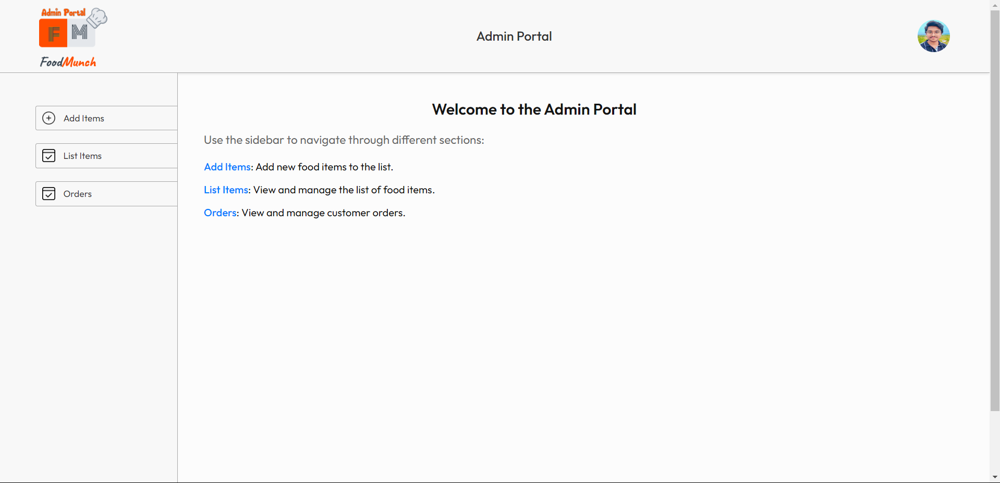

# Food Munch Online Delivery Application

This project is a complete food ordering system comprising a backend API, an admin portal, and a frontend application. It handles user authentication, food management, cart operations, order processing, and more.

## Table of Contents

- [Assets](#assets)
- [Technologies](#technologies)
- [Setup and Installation](#setup-and-installation)
- [API Endpoints](#api-endpoints)
- [Contributing](#contributing)
- [License](#license)
- [Contact](#contact)

## Assets

### Food Munch Frontend


### Food Munch Admin



## Technologies

- **Backend:**
  - Node.js: JavaScript runtime environment
  - Express: Web framework for Node.js
  - MongoDB: NoSQL database
  - Mongoose: ODM for MongoDB
  - Stripe: Payment processing
  - JWT: JSON Web Tokens for authentication
  - bcrypt: Password hashing
  - multer: Middleware for handling file uploads
  - cors: Middleware for enabling CORS

- **Frontend:**
  - React: For building the user interface
  - React Router: For handling routing within the application
  - Axios: For making HTTP requests
  - CSS: For styling

- **Admin Portal:**
  - React: For building the user interface
  - React Router: For handling routing within the application
  - Axios: For making HTTP requests
  - React Toastify: For displaying toast notifications
  - CSS: For styling the components

## Setup and Installation

### Backend

1. **Clone the Repository:**

    ```bash
    git clone https://github.com/varunchithiraala/Food-Munch-Delivery.git
    cd backend
    ```

2. **Install Dependencies:**

    ```bash
    npm install
    ```

3. **Set Up Environment Variables:**

    Create a `.env` file in the root directory with the following content:

    ```makefile
    PORT=4000
    MONGO_URI=your_mongodb_connection_string
    JWT_SECRET=your_jwt_secret_key
    STRIPE_SECRET_KEY=your_stripe_secret_key
    ```

4. **Run the Application:**

    ```bash
    npm run server.js
    ```

    The server will start on [http://localhost:4000](http://localhost:4000).

### Frontend

1. **Navigate to the Project Directory:**

    ```bash
    cd ../frontend
    ```

2. **Install Dependencies:**

    ```bash
    npm install
    ```

3. **Run the Application:**

    ```bash
    npm start
    ```

    The application will be available at [http://localhost:3000](http://localhost:3000).

### Admin Portal

1. **Navigate to the Project Directory:**

    ```bash
    cd ../admin
    ```

2. **Install Dependencies:**

    ```bash
    npm install
    ```

3. **Run the Application:**

    ```bash
    npm start
    ```

    The application will be available at [http://localhost:3001](http://localhost:3001).

## API Endpoints

### User Endpoints

- **Register User:**

    `POST /api/user/register`

    Body: `{ "name": "John Doe", "email": "john@example.com", "password": "Password@123" }`

- **Login User:**

    `POST /api/user/login`

    Body: `{ "email": "john@example.com", "password": "Password@123" }`

### Food Endpoints

- **Add Food:**

    `POST /api/food/add`

    Body: `{ "name": "Pizza", "description": "Delicious cheese pizza", "price": 9.99, "category": "Main Course" }`
    
    File: image (FormData)

- **List Food:**

    `GET /api/food/list`

- **Remove Food:**

    `POST /api/food/remove`

    Body: `{ "id": "food_id" }`

### Cart Endpoints

- **Add to Cart:**

    `POST /api/cart/add`

    Body: `{ "foodId": "food_id", "quantity": 2 }`

- **Remove from Cart:**

    `POST /api/cart/remove`

    Body: `{ "foodId": "food_id" }`

- **Get Cart:**

    `POST /api/cart/get`

- **Delete from Cart:**

    `POST /api/cart/delete`

    Body: `{ "foodId": "food_id" }`

### Order Endpoints

- **Place Order:**

    `POST /api/order/place`

    Body: `{ "userId": "user_id", "items": [{ "foodId": "food_id", "quantity": 2 }], "amount": 19.98, "address": { "street": "123 Main St", "city": "New York", "zip": "10001" }, "promoCode": "Varuncvk" }`

- **Verify Order:**

    `POST /api/order/verify`

    Body: `{ "orderId": "order_id", "success": "true" }`

- **User Orders:**

    `POST /api/order/userorders`

    Body: `{ "userId": "user_id" }`

- **List Orders:**

    `GET /api/order/list`

- **Update Status:**

    `POST /api/order/status`

    Body: `{ "orderId": "order_id", "status": "Shipped" }`

## Contributing

Contributions are welcome! Please follow these guidelines:

1. Fork the repository.
2. Create a new branch:
   ```bash
   git checkout -b feature-branch
3. Commit your changes:
   ```bash
   git commit -am 'Add new feature'
4. Push to the branch:
   ```bash
   git push origin feature-branch
5. Create a new Pull Request.

## License

This project is licensed under the MIT License - see the [LICENSE](LICENSE) file for details.

## Contact

For any questions or feedback, please contact:

- **Name:** Ch. Varun Kumar
- **Email:** varuncvk13@gmail.com
- **GitHub:** [https://github.com/varunchithiraala](https://github.com/varunchithiraala)
